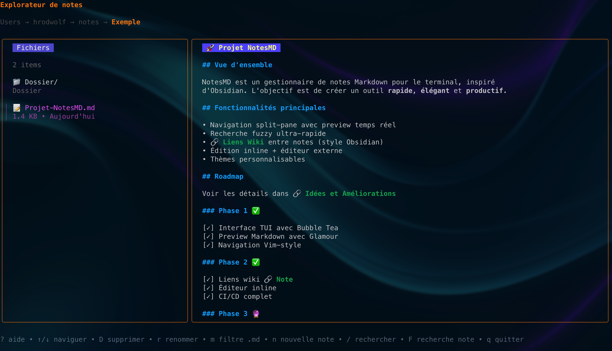

# NotesMD 📝

[](https://github.com/HrodWolfS/Notes-md/releases/latest)
[](https://github.com/HrodWolfS/Notes-md/actions/workflows/ci.yml)
[](https://goreportcard.com/report/github.com/HrodWolfS/Notes-md)
[](https://opensource.org/licenses/MIT)
[](go.mod)

> Un navigateur de notes Markdown élégant et rapide pour le terminal, construit avec Go et Bubble Tea.

NotesMD est un explorateur de fichiers interactif spécialisé pour les notes Markdown. Il offre une prévisualisation en temps réel avec Glamour, une navigation intuitive Vim-style, et des fonctionnalités avancées comme la recherche fuzzy, les signets et l'historique.

---

## 🖼️ Démos visuelles




---

## ✨ Fonctionnalités

- Interface TUI en deux colonnes (explorateur 30% + preview 70%)
- Prévisualisation Markdown temps réel avec Glamour et navigation Vim (`j`/`k`, `gg`, `G`, `Ctrl+d/u`)
- Recherche fuzzy (`/`) dans noms + recherche in-note (`F`) avec highlight ⚡
- CRUD via modals (`n`, `r`, `D`) + édition externe (`e`) avec `$EDITOR`
- Signets (`b`, `B`), fichiers récents (`Ctrl+R`) et copie clipboard (`y`, `Y`)
- Thème cyclable (`t`), filtres (`.md only`, fichiers cachés, tri) et écran d'accueil ASCII

## 📦 Installation

### Via `go install` (recommandé)

```bash
go install github.com/HrodWolfS/Notes-md/cmd/notesmd@latest
```

Le binaire `nmd` est déposé dans `$GOPATH/bin` (souvent `~/go/bin`). Ajoutez ce dossier au `PATH` si nécessaire :

```bash
# ---- NotesMD ----
export PATH="$(go env GOPATH)/bin:$PATH"   # à placer dans ~/.zshrc ou ~/.bashrc
```

### Installation manuelle

```bash
# Cloner le dépôt
git clone https://github.com/HrodWolfS/Notes-md.git
cd Notes-md

# Compiler le binaire
go build -o nmd ./cmd/notesmd

# Installer dans /usr/local/bin (optionnel)
sudo mv nmd /usr/local/bin/

# Ou installer dans ~/bin
mkdir -p ~/bin
mv nmd ~/bin/
export PATH="$HOME/bin:$PATH"  # Ajouter à ~/.bashrc ou ~/.zshrc
```

### Avec Makefile (optionnel)

```bash
make build           # construit nmd
sudo make install    # installe dans /usr/local/bin/nmd
make install-user    # installe dans ~/bin/nmd (sans sudo)
```

### Vérifier l'installation

```bash
nmd
```

## 🚀 Utilisation

### Démarrage rapide

```bash
# Lancer dans le répertoire courant
nmd

# Lancer dans un répertoire spécifique
nmd ~/Documents/notes

# Lancer avec un dossier de notes
nmd ~/obsidian-vault
```

### Navigation

| Touche              | Action                               |
| ------------------- | ------------------------------------ |
| `↑` `↓` `j` `k`     | Naviguer dans la liste               |
| `→` `l` `Enter`     | Entrer dans dossier / Ouvrir fichier |
| `←` `h`             | Dossier parent                       |
| `gg`                | Aller au début                       |
| `G`                 | Aller à la fin                       |
| `Ctrl+d` / `Ctrl+u` | Page suivante / précédente           |
| `Ctrl+o` / `Ctrl+i` | Historique arrière / avant           |
| `-`                 | Dossier parent                       |
| `~`                 | Aller à HOME                         |

### Gestion de fichiers

| Touche | Action                        |
| ------ | ----------------------------- |
| `n`    | Nouvelle note                 |
| `N`    | Nouveau dossier               |
| `D`    | Supprimer (avec confirmation) |
| `r`    | Renommer                      |
| `e`    | Éditer dans $EDITOR           |
| `c`    | Copier                        |
| `p`    | Coller                        |

### Recherche

| Touche  | Action                                |
| ------- | ------------------------------------- |
| `/`     | Recherche fuzzy dans les noms         |
| `F`     | Recherche dans la note ouverte        |
| `Enter` | Ouvrir résultat / Appliquer recherche |
| `Esc`   | Annuler recherche                     |

### Organisation

| Touche   | Action                  |
| -------- | ----------------------- |
| `b`      | Toggle bookmark         |
| `B`      | Voir tous les bookmarks |
| `Ctrl+R` | Fichiers récents        |
| `y`      | Copier chemin           |
| `Y`      | Copier contenu          |

### Filtres et affichage

| Touche    | Action                           |
| --------- | -------------------------------- |
| `m`       | Filtrer fichiers .md uniquement  |
| `.`       | Afficher/cacher fichiers cachés  |
| `s`       | Cycle mode tri (nom/date/taille) |
| `u` / `d` | Scroll preview haut/bas          |
| `t`       | Changer thème                    |

### Aide et navigation

| Touche | Action        |
| ------ | ------------- |
| `?`    | Afficher aide |
| `q`    | Quitter       |

## ⚙️ Configuration

La configuration est automatiquement créée dans `~/.config/notesmd/`.

### Structure des fichiers

```
~/.config/notesmd/
├── config.json    # Configuration utilisateur
└── state.json     # État de session (récents, bookmarks)
```

### Exemple config.json

```json
{
  "editor": "nvim",
  "theme": 0,
  "default_dir": "~/Documents/notes",
  "filters": {
    "md_only": false,
    "show_hidden": false
  },
  "search": {
    "content_search_enabled": true
  }
}
```

### Variables d'environnement

- `EDITOR` - Éditeur par défaut (défaut: `nvim`)

## 🛠️ Développement

### Prérequis

- Go 1.21 ou supérieur
- Git

### Cloner et compiler

```bash
git clone https://github.com/hrodwolf/notesmd.git
cd notesmd
go mod download
go build -o nmd ./cmd/notesmd
```

### Lancer en mode développement

```bash
go run ./cmd/notesmd ~/notes
```

### Structure du projet

```
notesmd/
├── cmd/notesmd/          # Code source principal
│   ├── main.go           # Point d'entrée
│   ├── model.go          # État de l'application
│   ├── update.go         # Logique de mise à jour
│   ├── view_*.go         # Rendus des vues
│   ├── modal.go          # Composants modaux
│   ├── notes.go          # Gestion des notes
│   ├── fs.go             # Opérations fichiers
│   ├── search.go         # Recherche de contenu
│   ├── config.go         # Configuration
│   ├── clipboard.go      # Intégration clipboard
│   ├── statusbar.go      # Barre de statut
│   └── theme.go          # Styles et couleurs
├── go.mod                # Dépendances Go
├── README.md             # Cette documentation
├── LICENSE               # Licence MIT
└── CLAUDE.md             # Guide pour Claude Code
```

## 🤝 Contribution

Les contributions sont les bienvenues ! N'hésitez pas à :

1. Fork le projet
2. Créer une branche (`git checkout -b feature/amazing-feature`)
3. Commit vos changements (`git commit -m 'Add amazing feature'`)
4. Push vers la branche (`git push origin feature/amazing-feature`)
5. Ouvrir une Pull Request

## 🐛 Rapporter un bug

Utilisez les [GitHub Issues](https://github.com/hrodwolf/notesmd/issues) pour rapporter des bugs ou suggérer des fonctionnalités.

## 📝 Roadmap

- [x] Navigation de base et prévisualisation
- [x] Recherche fuzzy dans noms de fichiers
- [x] Recherche in-note avec highlight
- [x] Signets et fichiers récents
- [x] Gestion de fichiers (créer/renommer/supprimer)
- [x] Persistance de configuration
- [x] Thèmes multiples
- [ ] Synchronisation cloud (Dropbox, iCloud)
- [ ] Support Git (status, diff dans preview)
- [ ] Export (PDF, HTML)
- [ ] Tags et métadonnées
- [ ] Templates de notes
- [ ] Plugin system

## 📜 Licence

Ce projet est sous licence MIT. Voir le fichier [LICENSE](LICENSE) pour plus de détails.

## 🙏 Remerciements

Construit avec :

- [Bubble Tea](https://github.com/charmbracelet/bubbletea) - Framework TUI
- [Bubbles](https://github.com/charmbracelet/bubbles) - Composants TUI
- [Lipgloss](https://github.com/charmbracelet/lipgloss) - Styles terminal
- [Glamour](https://github.com/charmbracelet/glamour) - Rendu Markdown

Inspiré par des outils comme [Obsidian](https://obsidian.md/), [Notion](https://notion.so), et [Ranger](https://github.com/ranger/ranger).

## 👤 Auteur

**hrodwolf**

- GitHub: [@hrodwolf](https://github.com/hrodwolf)

---

⭐ Si vous aimez ce projet, n'oubliez pas de lui donner une étoile sur GitHub !
